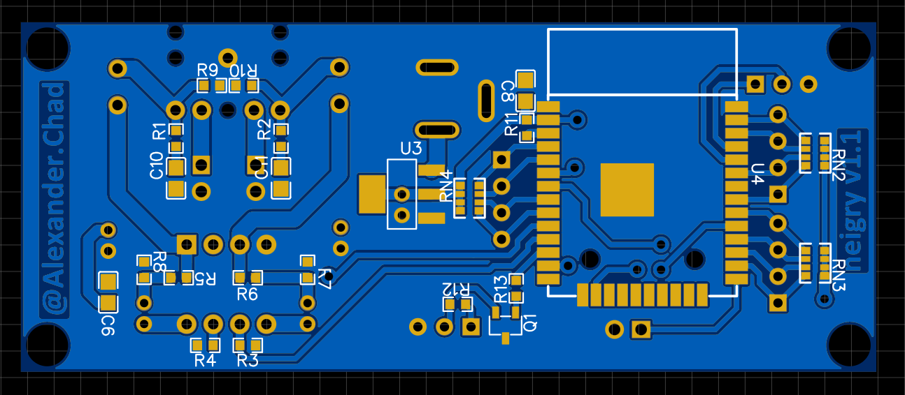
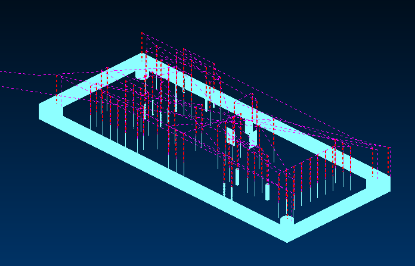
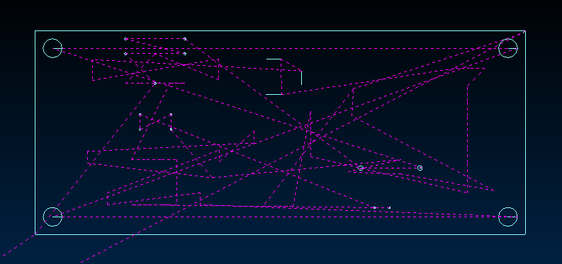
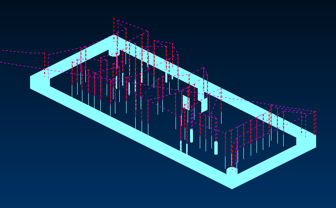
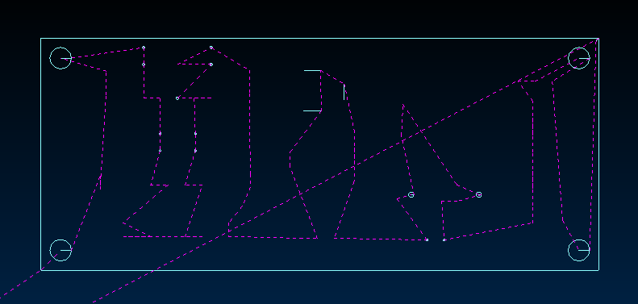

# Конвертор Gerber файлов (печатных плат) в GCode для 3Д принтера (на прошивке Klipper)
Алгоритм выполняет сбор точек (действий) из файлов `files/Drill_NPTH_Through.DRL`, `files/Drill_PTH_Through.DRL`, `files/Drill_PTH_Through_Via.DRL`, `files/Gerber_BoardOutlineLayer.GKO`, упорядочивает их для оптимизации маршрута шпинделя, генерирует код отверстий и линий.  

Пока код обрабатывает только сверление (ну и ограниченно фрезеровку)! Быть может, в будущем займусь и сделаю конвертор для лазерного станка, для формирования проводников на плате.  

Код очень простой, не учитывает всей спецификации Gerber файлов и очень легко может сломаться на плате, сложнее прямоугольника. Проверялся только на выходных файлах EasyEDA. В общем работоспособность не гарантируется.  

Алгоритм был написан за один вечер, на больничном, в полубреду. Серьезно его воспринимать не стоит.  

<details><summary>Как использовать</summary>  

1. положить в папку `files` файлы: `Drill_NPTH_Through.DRL`, `Drill_PTH_Through.DRL`, `Drill_PTH_Through_Via.DRL`, `Gerber_BoardOutlineLayer.GKO`, если какой-то этап не нужен, можно убрать файл, но для сохранения абсолютных координат рекомендую отключать через установку `gen_board_outline` и `gen_drill`.  
2. отредактировать параметры в файле `drill_to_gcode.py` под ваш станок:  
```
#####################################################
spindle_speed = 20000  # обороты шпинделя
d_frezy = 1.0  # 0.8  # диаметр фрезы
start_point = [129.0, 70.0]  # начальная точка
g0_speed = 1000  # скорость свободного перемещения
g1_speed = 300  # рабочая скорость
g1_tool_speed = 50  # скорость врезания
plunge_height = 0.1  # высота слоя врезания
safe_Z = 12  # безопасная высота
Null_Z = 0.1  # конечная высота сверловки
WpTn_Z = 2.5  # высота (толщина) заготовки
dr_dopusk = 0.2  # допуск в мм для отверстий
# менять направление при резке (должно компенсировать увод фрезы)
change_cut_dir = False
# генерировать резку контура
gen_board_outline = True
# генерировать сверловку
gen_drill = True
# генерировать отверстия методом спирали
gen_hole_spiral = True
#####################################################
```  
3. запустить `drill_to_gcode.py`  
4. получить результат в файле `out.gcode`  
</details>  

Пример работы:  
<details><summary>Исходная плата</b></i></summary>  

</details>  

<details><summary>Плата после загрузки, но без оптимизации маршрута</b></i></summary>

  
 </details>  

<details><summary>C оптимизацией маршрута</b></i></summary>

  
 </details>  

Видео с демонстрацией работы по полученной программе: [Тест алгоритма drill_to_gcode.py](https://dzen.ru/video/watch/657183fb4ad6bc380ea2aed5).

Статья на Дзене с подробностями: [Пишу простой конвертор Gerber файлов (печатных плат) в GCode](https://dzen.ru/a/ZXGKhrUrMW9CLh16?share_to=link).